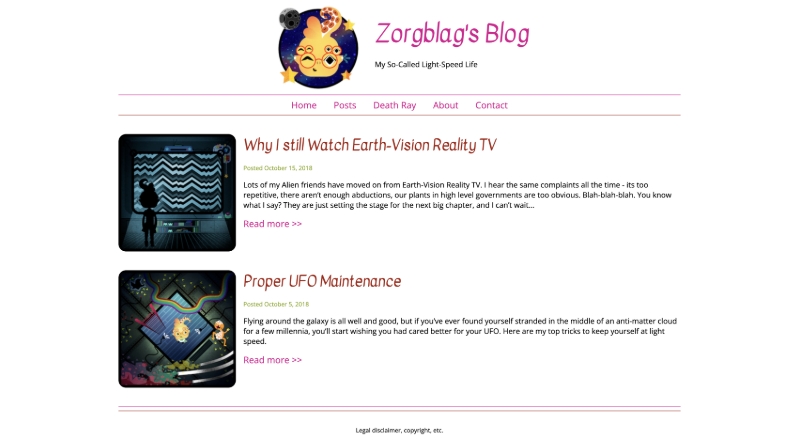

# Frontend Masters Bootcamp CSS Project

## Overview

This project is part of the [Frontend Masters Bootcamp](https://frontendmasters.com/bootcamp/) and is designed to demonstrate the use of various CSS properties and techniques learned throughout the course. The project is a blog page that includes comprehensive examples of CSS basics, classes, the cascade, spacing, and layout techniques.

## Project Structure

- **Blog-Begin**: Contains the my version of the project.
- **Blog-End**: Contains the instructor's completed version for reference.

## Screenshots

### Blog Page

  
_Screenshot of the blog page demonstrating the use of CSS for layout, typography, and styling._

## Key Features and Learnings

### Global Styling

- **Box Sizing**: Ensuring consistent box model across all elements.
  ```css
  html {
    box-sizing: border-box;
  }
  *,
  *:before,
  *:after {
    box-sizing: inherit;
  }
  ```
- **Resetting Margins and Padding**: Applying a reset to avoid browser inconsistencies.
  ```css
  * {
    margin: 0;
    padding: 0;
  }
  ```

### Typography

- **Font Family**: Setting custom fonts for the body and headings.
  ```css
  body {
    font-family: "Open Sans", sans-serif;
  }
  h1,
  h2,
  h3,
  h4,
  h5,
  h6 {
    font-family: "Kavivanar", cursive;
    font-weight: normal;
  }
  ```

### Header and Navigation

- **Flexbox**: Utilizing Flexbox for header layout.
  ```css
  header {
    display: flex;
    justify-content: center;
    gap: 1rem;
  }
  .rightheader {
    display: flex;
    flex-direction: column;
    justify-content: center;
  }
  ```
- **Nav Bar Styling**: Styling the navigation bar with borders and inline-block elements.
  ```css
  nav {
    text-align: center;
    border-top: 1px solid #da0090;
    border-bottom: 1px solid #a51f10;
    padding: 0.5rem 0;
  }
  nav ul li {
    display: inline-block;
  }
  ```

### Articles

- **Floats**: Using floats to arrange images and text.
  ```css
  .floatleft {
    float: left;
    margin-right: 1rem;
  }
  ```
- **Clearfix**: Clearing floats to maintain layout integrity.
  ```css
  section::after {
    content: "";
    display: table;
    clear: both;
  }
  ```
- **Styling Links**: Using pseudo-classes for link states.
  ```css
  a:link {
    color: #da0090;
    text-decoration: none;
  }
  a:visited {
    color: blue;
  }
  a:hover {
    color: purple;
    font-weight: bold;
    text-decoration: underline;
  }
  a:active {
    color: #7c8e88;
  }
  ```

### Footer

- **Footer Styling**: Centering text and using inline-block for social media icons.
  ```css
  footer {
    text-align: center;
    font-size: 0.8rem;
    border-top: 1px solid #a51f10;
    margin-top: 0.5rem;
  }
  footer ul {
    list-style-type: none;
  }
  footer ul li {
    display: inline-block;
  }
  ```

## CSS Concepts Covered

- **Selectors**: Element, class, ID, and descendant selectors.
- **Box Model**: Content, padding, border, and margin.
- **Pseudo-Classes**: `:link`, `:visited`, `:hover`, `:focus`, `:active`.
- **Flexbox**: For layout and alignment.
- **Floats and Clears**: For layout control.
- **Typography**: Custom fonts and text styling.
- **Shorthand Properties**: Using shorthand for concise CSS.

## Usage

To view the project, open `blog.html` in a web browser. Explore the layout and styling to see the CSS techniques implemented.

## Acknowledgments

This project was developed as part of the [Frontend Masters Bootcamp](https://frontendmasters.com/bootcamp/) and follows the guidelines and teachings from the [Introduction to CSS Course](https://frontendmasters.com/bootcamp/introduction-css/).
